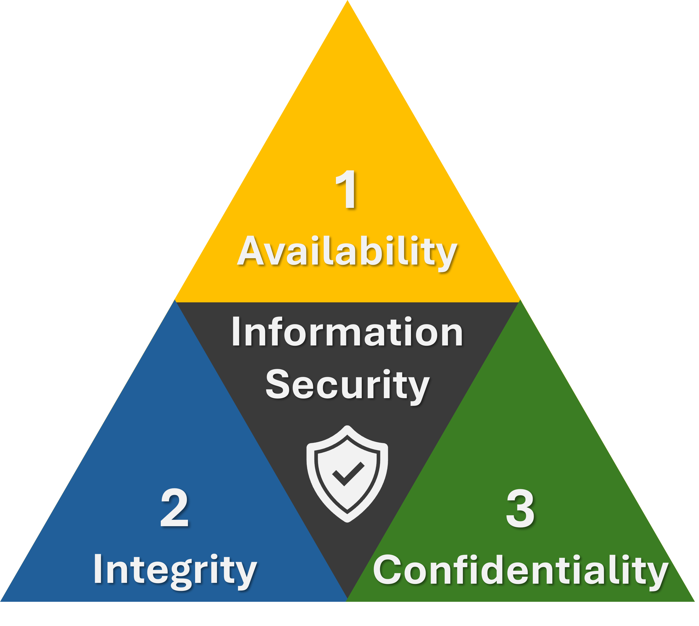

# CIA Triad

The three core principles of information security.

---

## 1. Availability
Systems and data must be **accessible when needed**.

- If a hospital's systems go down during an attack — Availability is broken
- Attack that targets this: **DoS / DDoS** (floods a system until it crashes)

## 2. Integrity
Data must be **accurate and unmodified** by unauthorized parties.

- If an attacker changes a number in a bank transfer — Integrity is broken
- Attack that targets this: **Man-in-the-Middle**, **SQL Injection**

## 3. Confidentiality
Data must only be **visible to those who are authorized**.

- If someone steals a password database — Confidentiality is broken
- Attack that targets this: **Phishing**, **Credential dumping**, **Sniffing**

---

## Quick reminder

| Letter | Principle | Broken by |
|--------|-----------|-----------|
| A | Availability | DDoS |
| I | Integrity | MitM, SQLi |
| C | Confidentiality | Phishing, sniffing |
