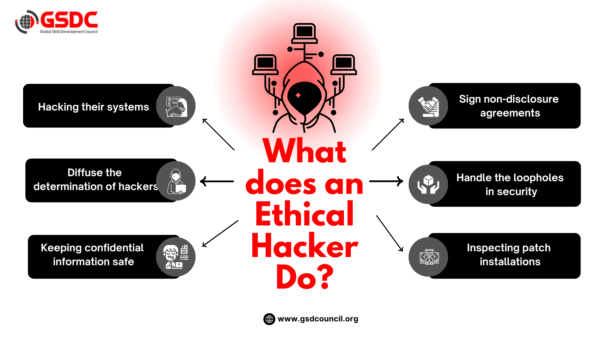

# Modul 1 — Introduktion till Cybersäkerhet

## Vad jag har lärt mig

---

### CIA-triaden

**Confidentiality**
> The information is safe from accidental or international disclosure.

Bara behöriga personer får se informationen. Om någon obehörig läser, kopierar eller stjäl data — är Confidentiality bruten.
- Attacker: Phishing, Sniffing, Credential dumping
- Skydd: Kryptering, åtkomstkontroll, MFA

---

**Integrity**
> The information is safe from accidental or intentional modification or alteration.

Data får inte manipuleras. Om någon ändrar, raderar eller förvanskar information utan tillstånd — är Integrity bruten.
- Attacker: Man-in-the-Middle, SQL Injection, Rootkit
- Skydd: Hashing, digitala signaturer, audit-loggar

---

**Availability**
> The information is available to authorized users when needed.

System och data måste vara tillgängliga när de behövs. Om ett system slås ut — är Availability bruten.
- Attacker: DDoS, Ransomware
- Skydd: Redundans, DDoS-skydd, regelbundna backuper

---

### Etisk Hacking

Etisk hacking = auktoriserat testande av system för att hitta sårbarheter innan angripare gör det.
- Skillnaden mot oetisk hacking: etiska hackare har **tillstånd**
- Kallas också: penetrationstestning / red teaming

---

## Mina anteckningar
*(Lägg till vad du vill komma ihåg här)*

